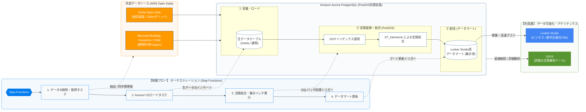

# telecom_infra_detection
世界中のモバイル・固定回線の実際の通信速度データと、都市の建物データを組み合わせ、人口や建物が密集しているにもかかわらず、通信環境が劣悪な「デジタル・ボトルネック地域」を特定するプロジェクトです。

### 地理空間データパイプライン アーキテクチャ図

```mermaid
flowchart LR
    %% ==========================================
    %% 1. オーケストレーション層（最上部で全体の流れを制御）
    %% ==========================================
    subgraph Orchestration ["【制御フロー】 オーケストレーション (Step Functions)"]
        direction LR
        af_main{{"Step Functions"}}:::airflow
        af_t1["1. データの検知・取得タスク"]:::af_task
        af_t2["2. Auroraへのロードタスク"]:::af_task
        af_t3["3. 空間結合・集計バッチ実行"]:::af_task
        af_t4["4. データマート更新"]:::af_task

        af_main --> af_t1 --> af_t2 --> af_t3 --> af_t4
    end

    %% ==========================================
    %% 2. データメインストリーム（左から右への一方向フロー）
    %% ==========================================
    
    %% [左端] 外部データソース
    subgraph ExtSource ["外部データソース (AWS Open Data)"]
        direction TB
        src_ookla["Ookla Open Data<br>(通信速度 / 300mグリッド)"]:::external
        src_ms["Microsoft Building Footprints / OSM<br>(建物形状Polygon)"]:::external
    end

    %% [中央] データウェアハウス & 空間処理
    subgraph Aurora ["Amazon Aurora PostgreSQL (PostGIS空間拡張)"]
        direction LR
        
        subgraph Layer_Ingest ["① 収集・ロード"]
            db_raw[("生データテーブル<br>(Ookla / 建物)")]:::db_node
        end

        subgraph Layer_Process ["② 空間変換・結合 (PostGIS)"]
            direction TB
            db_gist["GISTインデックス適用"]:::db_node
            db_intersect["ST_Intersects による空間結合"]:::db_node
            db_gist --> db_intersect
        end

        subgraph Layer_Mart ["③ 配信 (データマート)"]
            db_mart[("Looker Studio用<br>データマート (集計済)")]:::db_node
        end

        db_raw --> db_gist
        db_intersect --> db_mart
    end

    %% ==========================================
    %% 3. データ可視化・アナリティクス層（最下部/右端）
    %% ==========================================
    subgraph Analytics ["【利用層】 データ可視化・アナリティクス"]
        direction TB
        vis_looker["Looker Studio<br>(ビジネス / 都市計画向けBI)"]:::bi
        vis_qgis["QGIS<br>(詳細な空間解析ツール)"]:::gis
    end

    %% ==========================================
    %% フローの接続関係（線の交差を最小化）
    %% ==========================================
    
    %% A. 純粋なデータフロー (実線)
    src_ookla --> Layer_Ingest
    src_ms --> Layer_Ingest
    
    db_mart -->|軽量・高速クエリ| vis_looker
    Aurora -->|直接接続 / 詳細解析| vis_qgis

    %% B. Airflowからの制御シグナル (上から下への点線)
    af_t1 -.->|"抽出 / 四半期更新"| ExtSource
    af_t2 -.->|"生データのインサート"| db_raw
    af_t3 -.->|"SQLバッチ処理トリガー"| Layer_Process
    af_t4 -.->|"マート更新トリガー"| db_mart

    %% ==========================================
    %% スタイル定義（視認性を高める配色）
    %% ==========================================
    classDef external fill:#FF9900,stroke:#232F3E,stroke-width:1px,color:#fff;
    classDef airflow fill:#017CEE,stroke:#017CEE,stroke-width:2px,color:#fff;
    classDef af_task fill:#f8f9fa,stroke:#017CEE,stroke-width:1px,color:#333;
    classDef db_node fill:#fff,stroke:#336699,stroke-width:1px,color:#333;
    classDef bi fill:#4285F4,stroke:#4285F4,stroke-width:1px,color:#fff;
    classDef gis fill:#589632,stroke:#589632,stroke-width:1px,color:#fff;

    %% サブグラフ自体の見た目調整
    style Orchestration fill:#f4f9fe,stroke:#017CEE,stroke-width:1px,rx:8,ry:8
    style Aurora fill:#fafbfc,stroke:#336699,stroke-width:1px,rx:8,ry:8
    style ExtSource fill:#fff8f2,stroke:#FF9900,stroke-width:1px,rx:8,ry:8
    style Analytics fill:#f9fbf9,stroke:#589632,stroke-width:1px,rx:8,ry:8
```
